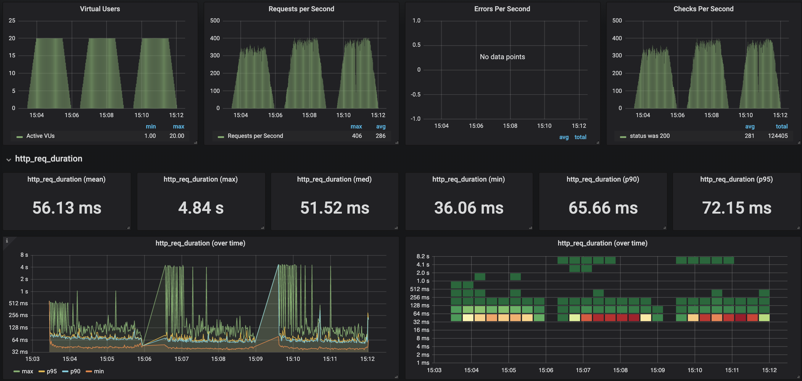
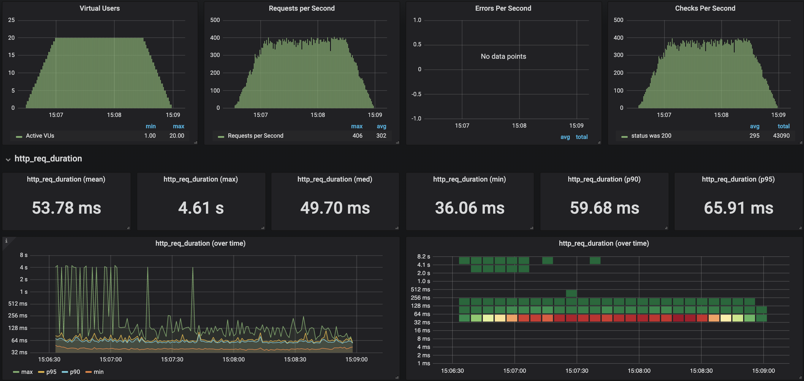
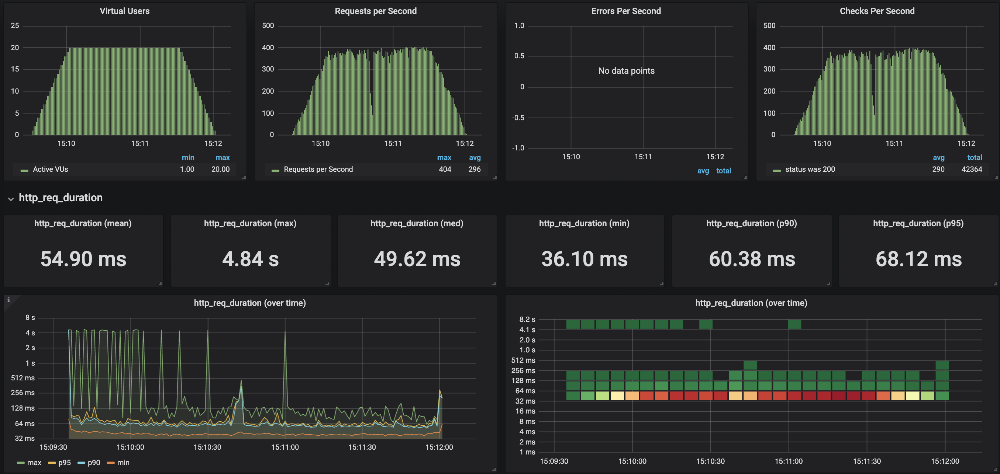
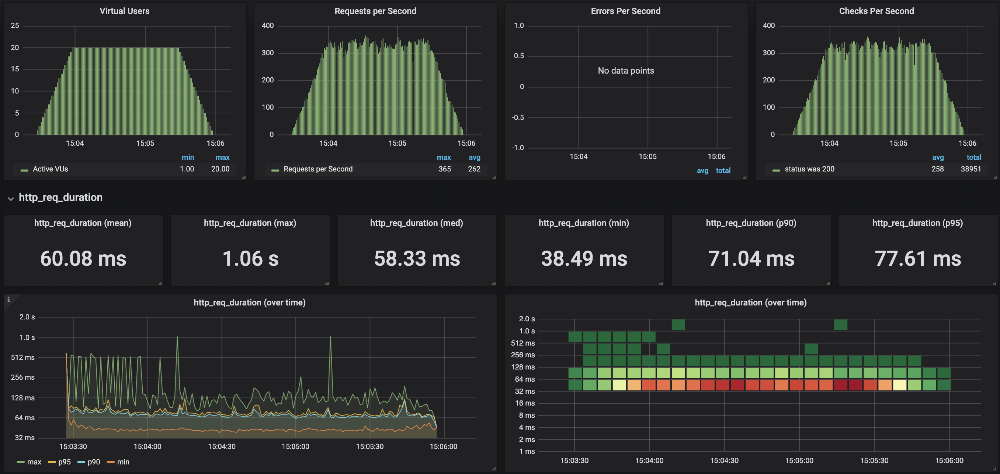

# AWS Lambda - Java 11
A comparison of AWS Lambda Java 11 with Java 8 (and NodeJS for reference).

#### Comparing Languages

##### Feature Changes
There are several new language features in Java 11, some of which may be beneficial for AWS Lambda
use-cases. 

Notably:
* Performance enhancements (although in the tests here no significant difference was apparent)
* New Http library:
https://openjdk.java.net/groups/net/httpclient/intro.html

One major feature of Java 9+ is the module system. It is disappointing to note that AWS Lambda
has not yet used this capability and that Java still misses the capability to build lighter 
weight quick starting functions similar to the capabilities offered in NodeJS.

##### Performance

Results from k6/Graphana for load test runs, beginning with NodeJS, then Java 8 followed by Java 11:

Conclusions:
 
Java 8 and Java 11 are almost identical in runtime performance once warm.

Java 11 seems to be worse for cold starts (perhaps due to less usage at time of writing).

Java (both 8 and 11) have better runtime performance than NodeJS once warm (15% better at the median).

However Java suffers greatly on cold start times. 

Java 8 cold start times were 2-4.6s. 

Java 11 cold starts were all between 4-4.84s. 

NodeJS cold starts were significantly better at 256ms-1.06s.

##### Auto-scaling and provisioned concurrency
In December 2019 AWS announced another feature that's worth mentioning which I think
brings Java lambda more into the realm of a reasonable choice for an API: 
[Provisioned Concurrency](https://aws.amazon.com/about-aws/whats-new/2019/12/aws-lambda-announces-provisioned-concurrency/)

